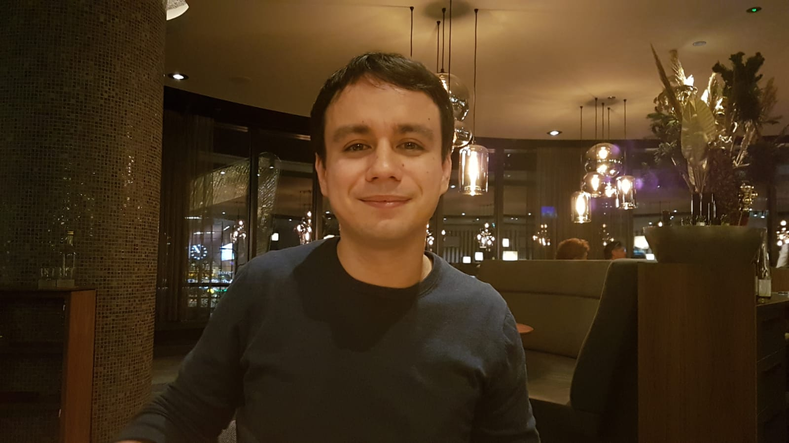
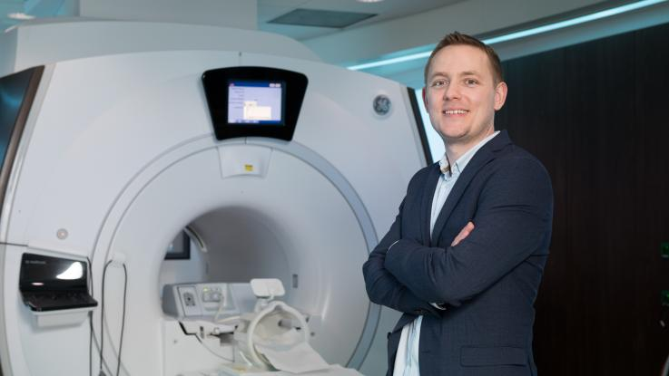

---

# The history of QDECR

(Section on the history of QDECR... To be added :D)

---

# Sander Lamballais

```{r echo = FALSE, out.width = '60%'}

```

Sander Lamballais is currently a last-year PhD candidate at the Erasmus MC in Rotterdam, the Netherlands. His work focuses on the antecedents and consequences of brain changes across the lifespan.

---

# Ryan Muetzel

```{r echo = FALSE, out.width = '60%'}

```

Ryan Muetzel is a postdoctoral researcher at the Erasmus MC in Rotterdam, the Netherlands. He successfully obtained his PhD degree in 2016, for his thesis titled [The Connections Within: Pediatric population-based neuroimaging of brain development](https://www.generationr.nl/wp-content/uploads/2017/03/Proefschrift-Muetzel.compressed.pdf). He has (co-)authored [over 60 papers](https://www.ncbi.nlm.nih.gov/pubmed/?term=Muetzel%20RL%5BAuthor%5D&cauthor=true&cauthor_uid=31085031).