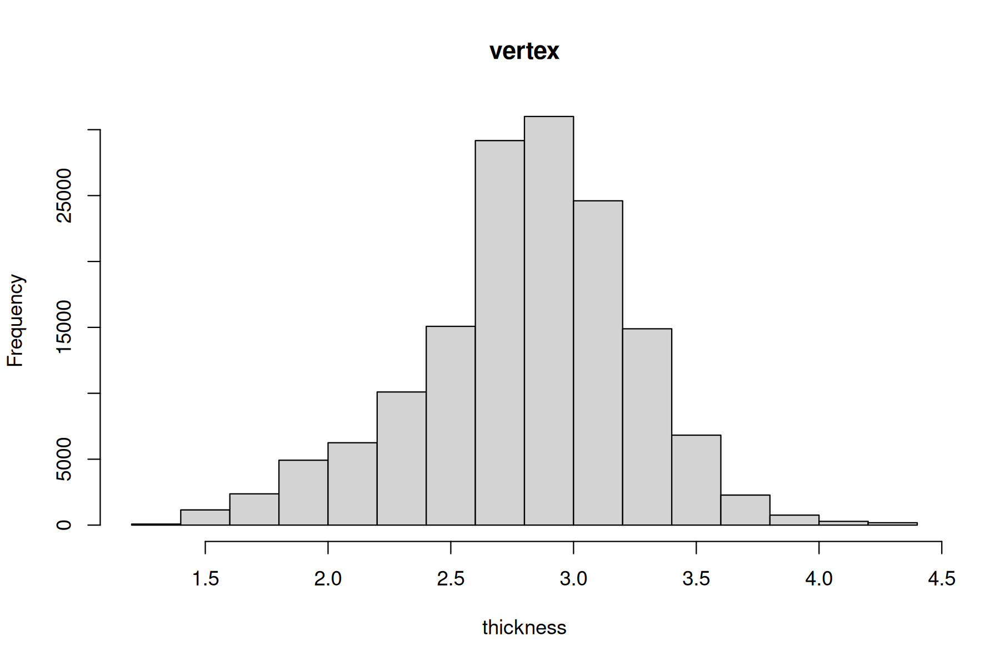
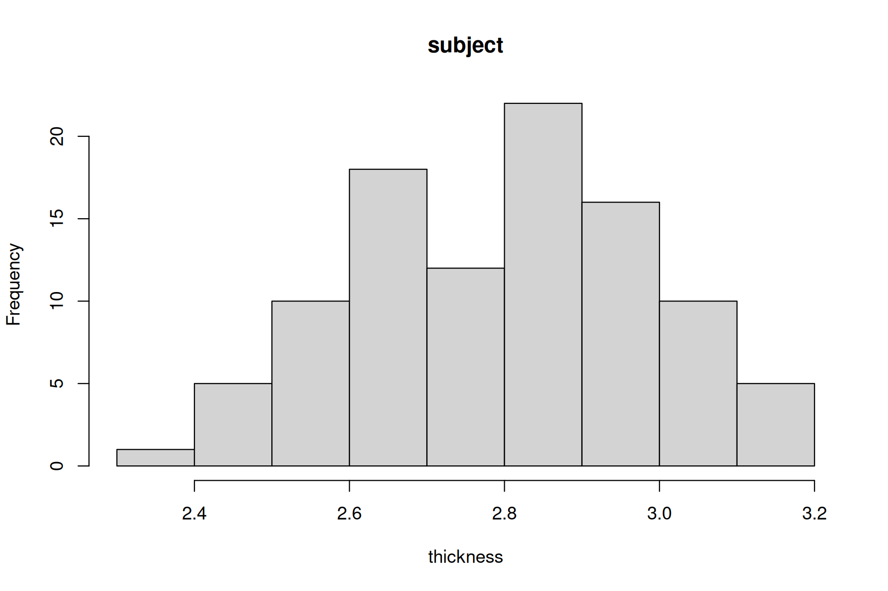

An analysis returns a [result](/glossary#result), and writes its maps and tables to the [output directory](/get-started#what-gets-written-to-disk). This tutorial reads one result from end to end: the left hemisphere of the [quick start](/tutorials/quick-start), thickness against age and sex in 99 people. All the output below is what that run printed.

## Printing a result

Printing a result lists the settings it ran with, the sample, and a summary of the data. QDECR prints the same list at the end of every run:

```r output=lh.print.txt
out
```

Each line is tagged with what it describes:

| Tag | What it tells you |
|---|---|
| `[call ]` | The call that made the result. |
| `[input]` | The settings: hemisphere, project, cores, target, the smoothing of the data read (`fwhm`), and how the output was laid out. |
| `[paths]` | Where QDECR read and wrote: the subjects, FreeSurfer, the temporary files, the output directory and the mask. |
| `[data ]` | The sample: subjects (distinct IDs), rows of the data, [imputed datasets](/tutorials/imputed-data), and vertices per subject. |
| `[model]` | The model: the function that fitted it, the vertex measure, the formula, and whether there were [weights](/tutorials/formulas-and-design#weights). |
| `[mask ]` | The [mask](/glossary#mask) and how many vertices it holds. |
| `[stack]` | The [stacks](#stacks), by number. |
| `[post ]` | What was worked out after the fit, below. |

The `[post ]` lines need a word each:

- **Final N vertices** is the mask the correction used. While estimating the smoothness, `mris_fwhm` prunes the odd vertex from the mask it was given, two here.
- **Estimated fwhm** is the [smoothness](/tutorials/statistics#smoothness) of the residuals, rounded to the whole millimetre that picks FreeSurfer's simulations: 15 mm. `qdecr_fwhm(out)` returns it.
- **Mean thickness per vertex** and **per subject** are the same number, the mean over all subjects and vertices, reached in two orders.
- **SD thickness per vertex** is the standard deviation across subjects at each vertex, averaged over the vertices: how much people differ at the same place, 0.36 mm. **SD thickness per subject** is the standard deviation across the cortex within each subject, averaged over the subjects: how much thickness varies from place to place, 0.53 mm.

The result answers the usual questions of a model, too: `nobs(out)` gives the number of subjects, and `formula(out)` the formula.

## Summaries of the clusters

`summary()` lists every [significant cluster](/glossary#significant-cluster) of every stack, one row each, and with `annot = TRUE` the regions each covers most:

```r output=lh.summary.txt
summary(out, annot = TRUE)
```

| Column | What it holds |
|---|---|
| `variable` | The stack the cluster belongs to. |
| `cluster` | Its number within the stack, as `mri_surfcluster` numbers them. The [cluster map](/glossary#cluster-map) uses the same numbers. |
| `n_vertices` | How many vertices it covers. |
| `mean_thickness` | Meant to be the mean thickness over those vertices, but wrong in 0.9.0: see below. The column is named after the vertex measure. |
| `mean_coefficient` | The mean of the stack's coefficient over the cluster, in the measure's units per unit of the predictor: here, mm per year of age. |
| `mean_se` | The mean of its standard error. |
| `top_region1`, ... | The regions the cluster covers most, each with two percentages: how much of the cluster lies in the region, then how much of the region the cluster covers. |

So the cluster for age holds 113,272 of the 149,953 vertices, and on average thickness drops 0.029 mm a year across it. The largest part of it, 9.9%, lies in the superior frontal gyrus, and it covers 92% of that region. A stack with no significant cluster, like `sexmale` here, has no row. The intercept's cluster always covers the whole cortex and means nothing: ignore it.

The regions come from the Desikan-Killiany atlas, `aparc.annot` in the target's `label` directory. `file` picks another annotation there, and `regions` how many to list:

```r
summary(out, annot = TRUE, file = "aparc.a2009s.annot", regions = 5)
```

> [!WARNING]
> In 0.9.0 the `mean_` column of the measure averages the wrong vertices: `summary()` lines up the per-vertex means, which cover only the vertices in the mask, with a list of every vertex of the hemisphere. The number is close to right for a cluster that covers most of the cortex, as here, and can be far off for a small one. Work it out yourself instead:
>
> ```r
> vertex_mean <- numeric(length(out$post$final_mask))
> vertex_mean[as.logical(out$post$final_mask)] <- out$post$mgh_description$vertex_mean
> mean(vertex_mean[qdecr_read_ocn(out, "age")$x == 1])  # cluster 1 of age
> ```
>
> The other columns are right.

`summary()` returns a data frame, so it can be filtered, sorted or saved like any other. QDECR already saves the one with `annot = TRUE` in the output directory, as the tab-separated `significant_clusters.txt`.

### FreeSurfer's cluster table

`mri_surfcluster`, which finds the clusters, writes a table of its own for each stack, with things `summary()` leaves out: the area, the peak, and the cluster-wise p-value. The result knows where each stack's table is:

```r
writeLines(readLines(out$stack$cluster.summary[[2]]))
```

It opens with some forty lines on how the clusters were found. The last few, for age:

```r output=lh.age.cluster.summary.txt lines=36-42
```

| Column | What it holds |
|---|---|
| `Max`, `VtxMax` | The peak: the largest −log<sub>10</sub>(p) in the cluster, and its vertex. 27.2 means p ≈ 10<sup>−27</sup>. |
| `Size(mm^2)` | The cluster's area on the white matter surface of `fsaverage`. |
| `MNIX`, `MNIY`, `MNIZ` | Where the peak lies, in MNI coordinates. |
| `CWP`, `CWPLow`, `CWPHi` | The [cluster-wise p-value](/glossary#cluster-wise-p-value), with its 90% confidence interval. 0.0001 is the smallest that 10,000 simulations can give. |
| `NVtxs` | The number of vertices, as in `summary()`. |
| `WghtVtx` | The sum of −log<sub>10</sub>(p) over the cluster's vertices. |
| `Annot` | The region the peak lies in. |

The header above it records the settings: `CSD thresh 3.000000` is the [cluster-forming threshold](/glossary#cluster-forming-threshold) as −log<sub>10</sub>(p), p < 0.001, and `CW PValue Threshold: 0.025` is `cwp_thr`. [Understanding the statistics](/tutorials/statistics) explains both.

## Histograms

`hist()` draws the distribution of the measure, as a first check that the data look like thickness should. By default it takes the mean of each vertex across subjects:

```r
hist(out)
```



Thickness runs from about 1.5 to 4 mm across the cortex, which is right for adult and adolescent brains. Values near zero would mean vertices outside the cortex had crept into the mask; a second peak, a group of vertices unlike the rest.

With `qtype = "subject"` it takes the mean of each subject across the vertices instead:

```r
hist(out, qtype = "subject")
```



This is the one to look at for a subject whose processing went wrong: a failed surface, or a scan from someone else's study, lands far from the rest. Here the subjects run from 2.3 to 3.2 mm, and none stands apart from the rest.

`hist()` passes anything else to R's own `hist()`, so `breaks`, `main` and `col` work as usual.

## Stacks

A [stack](/glossary#stack) is one coefficient of the model, with every map QDECR writes for it. `stacks()` lists them, in the order of the design matrix's columns:

```r output=lh.stacks.txt
stacks(out)
```

The number is the stack's place in that list, and it names the files in the output directory: stack 2 is `age`, so its t-statistic is `stack2.t.mgh`. Every function that takes a stack accepts the name or the number, so `qdecr_snap(out, "age")` and `qdecr_snap(out, 2)` draw the same map. [Formulas and design](/tutorials/formulas-and-design#covariates-and-factors) explains how R names the columns, and [Saving, loading and MGH files](/tutorials/saving-and-loading#reading-the-maps) how to read a stack's maps into R.
