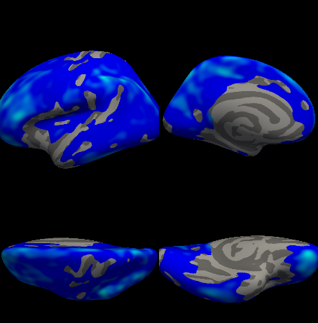
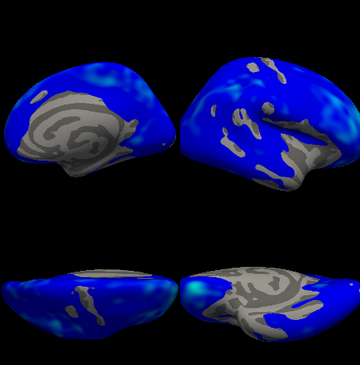

This tutorial runs one complete analysis of real data: cortical thickness against age and sex in 99 people aged 6 to 31. Every output on the page is what that run printed, and every figure is what it drew. The rest of the tutorials use the same analysis, so its results will look familiar there.

You need QDECR and FreeSurfer installed and working, as [Get started](/get-started) describes. The run on this page used QDECR 0.9.0 with FreeSurfer 7.4.1 and R 4.5, in Ubuntu under WSL2. The scripts that reproduce it, from downloading the data to the figures, are [in the repository](https://github.com/slamballais/QDECR/tree/master/website/tools/example).

## The data

The scans come from [ABIDE I](https://fcon_1000.projects.nitrc.org/indi/abide/), the Autism Brain Imaging Data Exchange, a public collection of MRI scans shared for research, as the [Preprocessed Connectomes Project](http://preprocessed-connectomes-project.org/abide/) ran them through FreeSurfer, `-qcache` included. From its NYU site we took the typically developing participants, the ones without an autism diagnosis, less one whose scan failed the project's quality check: 99 people aged 6.5 to 31.8, 26 of them female. The analysis leaves diagnosis out on purpose: the example shows what QDECR does, not a finding about autism.

Each participant has a directory in the [subjects directory](/glossary#subjects-directory), named by their ID. QDECR reads a single file from it per hemisphere, the thickness map `-qcache` resampled to `fsaverage` and smoothed at 10 mm:

```text
subjects/
├── fsaverage -> $FREESURFER_HOME/subjects/fsaverage
├── NYU_0051036/surf/lh.thickness.fwhm10.fsaverage.mgh
├── NYU_0051036/surf/rh.thickness.fwhm10.fsaverage.mgh
├── NYU_0051038/surf/...
└── ...
```

Those 198 files, 130 MB together, are all the imaging data the analysis needs. `fsaverage`, the [target](/glossary#target), is linked in from FreeSurfer, as Get started [shows](/get-started#check-that-it-works) for subjects processed elsewhere.

The data frame has one row per participant. `id` holds the names of their directories, and `sex` becomes a factor with `female` first, so that the effect of sex is the difference of men from women:

```r output=pheno.head.txt
library(QDECR)

pheno <- read.csv("phenotypes.csv")
pheno$sex <- factor(pheno$sex, levels = c("female", "male"))
head(pheno)
```

QDECR finds the subjects through `SUBJECTS_DIR`, and so do the FreeSurfer tools it calls, so set it in the shell before R starts, as for FreeSurfer itself. The `dir_subj` argument points QDECR somewhere else, but not those tools: if you use it, keep the two the same.

## Run the analysis

One call fits the model at every vertex of the left hemisphere and corrects for multiple testing:

```r
out <- qdecr_fastlm(
  qdecr_thickness ~ age + sex,
  data = pheno,
  id = "id",
  hemi = "lh",
  project = "age_sex",
  dir_out = "results",
  dir_tmp = "/dev/shm",
  n_cores = 4
)
```

- `qdecr_thickness ~ age + sex` is the model: thickness at each vertex, on age and sex. The `qdecr_` prefix marks the [vertex measure](/tutorials/formulas-and-design#the-vertex-measure).
- `project` names the analysis. With the hemisphere and the measure it becomes `lh.age_sex.thickness`, the name of the [output directory](/get-started#what-gets-written-to-disk) inside `results/`.
- `dir_tmp = "/dev/shm"` keeps the large temporary files in memory, and `n_cores = 4` spreads the work over four processes. [Performance and memory](/tutorials/performance) explains both.

QDECR reports each stage as it goes. It begins like this, the four `starting worker` lines being the processes `n_cores` asked for:

```r output=lh.log.txt lines=1-28
```

After loading the vertex data it fits the model at the 149,955 vertices of the cortex, estimates how smooth the residuals are with FreeSurfer's `mris_fwhm`, and hands each coefficient's map to `mri_surfcluster` for the [cluster-wise correction](/tutorials/statistics#cluster-wise-correction). Both FreeSurfer tools print a good deal on the way. On four cores the whole run took 61 seconds.

## Look at the results

`out` is the [result](/glossary#result): the settings, the sample and a summary of the data, with the maps left on disk. Printing it gives the overview:

```r output=lh.print.txt
out
```

The call reads `hemi = hemi` and `dir_out = results` because the run on this site looped over both hemispheres, with `clobber = TRUE` so it could be repeated over its own results. The smoothness of the residuals came out at 15 mm, higher than the 10 mm the data were smoothed with, which is usual for anatomical data. [Inspecting results](/tutorials/inspecting-results#printing-a-result) goes through the rest line by line.

The model has three coefficients, so the result has three [stacks](/glossary#stack), each with its own maps and its own clusters:

```r output=lh.stacks.txt
stacks(out)
```

`summary()` lists the [significant clusters](/glossary#significant-cluster), and with `annot = TRUE` the regions of the Desikan-Killiany atlas they cover most:

```r output=lh.summary.txt
summary(out, annot = TRUE)
```

- **Age** has one significant cluster, 113,272 vertices and 59,037 mm², three quarters of the cortex. Its mean coefficient is −0.029: across the cluster, the cortex is 0.029 mm thinner for each year of age, about 0.7 mm between the youngest participant and the oldest, on a mean thickness of 2.8 mm. The cortex thins through childhood and adolescence, and on a sample this size the effect is hard to miss.
- **Sex**, `sexmale`, has no row: no cluster of it survived the correction.
- **The intercept** always covers the whole cortex, because it tests whether thickness is zero. It has no meaning here; ignore it.

In each region, the first percentage is how much of the cluster lies in that region, and the second how much of the region the cluster covers.

## Plot the clusters

`qdecr_snap()` has Freeview draw a stack's map on the inflated surface of `fsaverage`, only where the clusters are significant, from four sides, and puts the four views together. It needs Freeview and a display to draw on, and the `magick` package:

```r
qdecr_snap(out, "age")
```



Blue marks a negative coefficient: thinner with age. The grey patches are the vertices outside the cluster, the medial wall among them, which has no cortex to measure. [Plotting](/tutorials/plotting) covers the other maps, the colours and Freeview itself.

## Both hemispheres

One analysis covers one [hemisphere](/glossary#hemisphere), so a whole-brain study runs twice. The default cluster-wise threshold, `cwp_thr = 0.025`, is already 0.05 split over the two:

```r
for (hemi in c("lh", "rh")) {
  out <- qdecr_fastlm(
    qdecr_thickness ~ age + sex,
    data = pheno, id = "id", hemi = hemi, project = "age_sex",
    dir_out = "results", dir_tmp = "/dev/shm", n_cores = 4
  )
  print(summary(out, annot = TRUE))
}
```

The right hemisphere tells the same story: one cluster for age, 117,846 vertices and 61,169 mm², with a mean coefficient of −0.029, and none for sex.

```r output=rh.summary.txt
summary(out, annot = TRUE)
```



## Where to go next

- [Inspecting results](/tutorials/inspecting-results): everything `print()` and `summary()` show, FreeSurfer's own cluster table, and the histograms.
- [Plotting](/tutorials/plotting): the other maps, the colour scale, and Freeview.
- [Formulas and design](/tutorials/formulas-and-design): what else the model can say.
- [Understanding the statistics](/tutorials/statistics): what the correction does, and why the smoothness matters.
